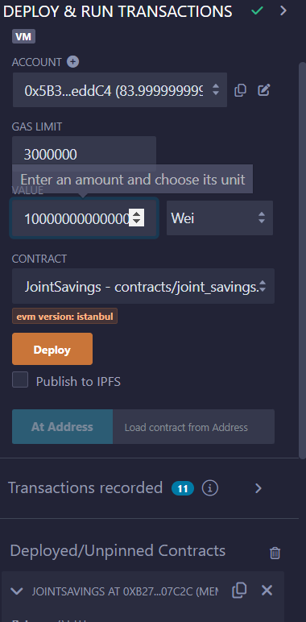
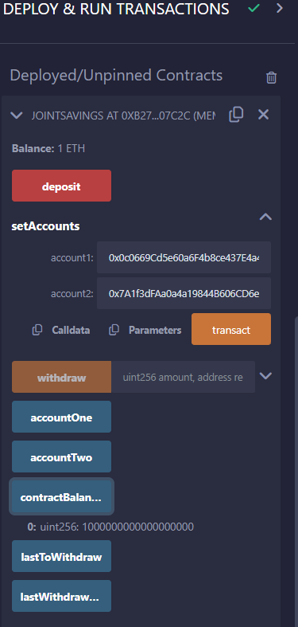
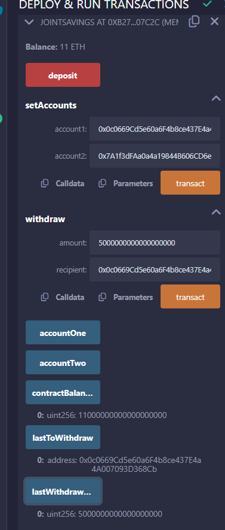
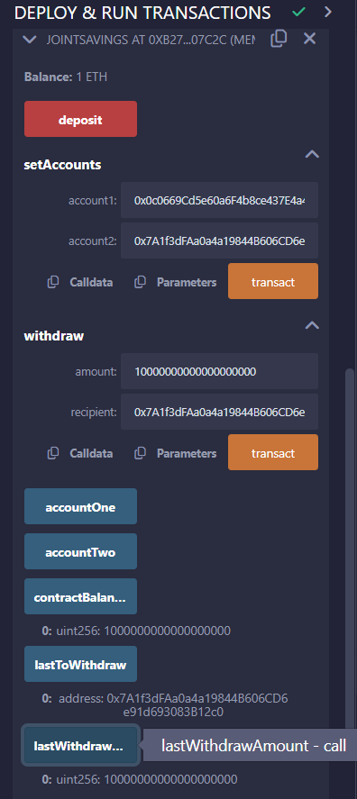

In this project, a Solidity smart contract is created to automate many of thefinancial processes and features, such as hosting joint savings accounts. Solidity smart contract accepts two user addresses. These addresses will be able to control a joint savings account. Created smart contract will use ether management functions to implement a financial institution’s requirements for providing the features of the joint savings account. These features will consist of the ability to deposit and withdraw funds from the account.

Dummy account1 address: 0x0c0669Cd5e60a6F4b8ce437E4a4A007093D368Cb
Dummy account2 address: 0x7A1f3dFAa0a4a19844B606CD6e91d693083B12c0

## Execution Results 
Images confirming that the deposit and withdrawal transactions to test the JointSavings functionality are provided in folder execution_results.

### Testing for Deposit Functions  

|Transaction1                                         | Transaction1_Balance
| --------------------------------------------------  | --------------------------------------------------      
|          |  

### Testing for Withdrawl Functions 
|Withdrawl1                                           | Withdrawl2
| --------------------------------------------------  | --------------------------------------------------      
|              |  